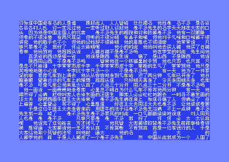

# C64 GB2312 Text Renderer (han64)

A GB2312 Chinese text renderer for the Commodore 64, using 8×8 bitmap fonts with dynamic character caching.



## Scope (v1 - Current: Rendering)

- 2501 Simplified Chinese characters (GB2312 rows $B0-$D7)
- 8×8 pixel bitmap font (8 bytes per glyph)
- GB2312-encoded text display from binary files
- Dynamic character caching (256 character slots)
- Rank-based GB2312 → glyphID lookup
- Offline table generation in Python
- Runtime rendering on C64 in 6502 assembly (ACME)

## Scope (v2 - Future: IME)

- Pinyin input method with candidate selection
- Interactive text editing
- Cursor movement and scrolling
- Dual charset support (512 character slots)
- See "Future Work" section below

## Core Architecture (v1)

```
GB2312 text file (chabuduo.bin)
  ↓
GB2312 → glyphID lookup (rank-based tables)
  ↓
Cache check (2502-byte cache array)
  ↓
Copy glyph bitmap (8×8) if not cached
  ↓
Write character code to screen RAM
  ↓
VIC-II renders using custom charset
```

### Key Principles

- No Unicode at runtime
- Dense internal glyphID (0..2500)
- GB2312 used only for I/O
- All heavy processing offline
- Self-modifying code for fast glyph copies

## Glyph Set

**Exactly 2501 Hanzi**

All are:

- GB2312 encodable
- BMP Unicode (no UTF-16 surrogates)

**Additional characters:**

- ~70 ASCII
- 8 GB2312 punctuation/symbols (rows 1–15)

### Glyph Storage

**font8.bin**

Layout:

- glyphID × 8 bytes
- 1 byte per row, 8 bits used (8×8 bitmap)

## glyphID Ordering (Important)

**glyphID is assigned in GB2312 row/column order**

Why:

- Simplifies GB2312 encoding/decoding
- Enables reuse of a single glyphID → gb2312 table
- Improves locality when rendering text
- Avoids a second reverse-mapping table

Frequency is handled inside IME candidate ordering, not glyphID numbering.

## Encoding: GB2312

- **ASCII:** `0x00–0x7F` (currently skipped in v1)
- **Hanzi:** 2 bytes
  - hi byte (row): `0xB0–0xD7` (40 rows supported)
  - lo byte (col): `0xA1–0xFE` (94 columns per row)
- **Unused / invalid:** Other byte ranges
- No BOM
- Stateless, streaming-friendly

GB2312 is strictly an I/O format, not used for internal logic.

### GB2312 Lookup Implementation

The runtime uses a **rank-based encoding** to compress the GB2312 → glyphID mapping:

Each row ($B0-$D7) has a table with:

- **Base glyphID** (2 bytes): Starting glyphID for this row
- **Rank array** (94 bytes): For each column ($A1-$FE), stores rank (0..count-1) or $FF if missing

This allows missing characters to be represented efficiently without allocating glyphIDs for unused GB2312 codes.

## Runtime Tables (v1)

Generated offline via Python (`tools/gb40.py`).

### gb40_rows.asm

Contains 40 row tables (`gb_row_B0` through `gb_row_D7`), each with:

```
!word baseGlyphID       ; 2 bytes
!byte rank[94]          ; 94 bytes: rank or $FF if missing
```

Referenced by pointer tables `gb_row_ptr_lo` and `gb_row_ptr_hi` in main.asm.

## Character Cache

**cache** (2502 bytes in main.asm)

- Indexed by glyphID (0..2501)
- Stores character slot (0-255) if glyph is loaded, or 0 if not cached
- When cache fills (chrptr reaches 256), subsequent characters show as space

This limits visible unique characters to 256 at once, but allows documents with 2501+ total characters through caching.

## Python Build Pipeline

**Inputs:**

- `gb2312_chars.txt` (2501 Hanzi with GB2312 codes)
- Font bitmap data (8×8 bitmaps)

**Outputs:**

- `font8.bin` (2501 × 8 bytes)
- `gb40_rows.asm` (40 row tables with rank encoding)

All tables are included in assembly using `!binary` and `!source`.

## Runtime (C64 / 6502)

- No UTF-8
- No Unicode at runtime
- No dynamic memory
- All tables are read-only
- Assembler: ACME
- Build: `acme main.asm` (or see Makefile)

**Rendering path (v1):**

1. Read GB2312 byte pair from text stream
2. Lookup glyphID via `GB2312_LookupGlyphID` (rank-based)
3. Check cache array indexed by glyphID
4. If not cached, copy 8×8 bitmap via `CopyGlyph8` to custom charset
5. Write character slot to screen RAM
6. VIC-II displays using custom charset at $3000

## What This Is Not

- Not UTF-16
- Not Unicode runtime
- Not dictionary-based (yet)
- Not Traditional Chinese
- Not GBK/GB18030 runtime (but compatible offline)

## Future Work (v2 - IME)

### Pinyin IME Features

- Pinyin input method with syllable parsing
- Initial buckets (b, p, m, f, d, t, n, l, etc. + Ø for vowel-initial)
- Candidate selection UI
- Phrase dictionary (2–4 chars)
- Jianpin abbreviation mode
- MRU learning
- Frequency-based candidate ordering

### Enhanced Rendering

- Dual charset support (512 character slots via raster IRQ)
  - Charset1 for top half of screen
  - Charset2 for bottom half
  - Raster IRQ at row 13 (scanline 104) to switch
  - Second IRQ at row 25 (scanline 200) to switch back
- Scrolling support (row copy + IRQ adjustment)
- Cursor movement (color-based or dedicated glyph)
- Interactive text editing

### Data Sources

- Unihan Database for pinyin mappings
- SUBTLEX-CH or Jun Da for frequency data
- UTF-8 import/export tools

## Design Philosophy

- Structure beats cleverness
- Offline complexity, runtime simplicity
- Encoding ≠ language
- 6502 first, modern tooling second

## Text Rendering (v1)

- VIC-II text mode with custom charset
- 40×25 characters
- Custom charset at $3000 (bank 6)
- Screen RAM at $0400
- Color RAM at $D800 (currently set to light gray $0F)
- Character limit: 256 unique glyphs on screen at once

## IME Rendering (v2 - Future)

- Top line: IME input and candidate area
- Show max 10 candidates: `ying 1英 2婴 3鹰 4应 5营 6蝇 7迎 8赢 9盈 0影`
- Next/prev page markers if >10 candidates
- Lower 24 lines: normal text view area
- Cursor moves in text area, not IME area
